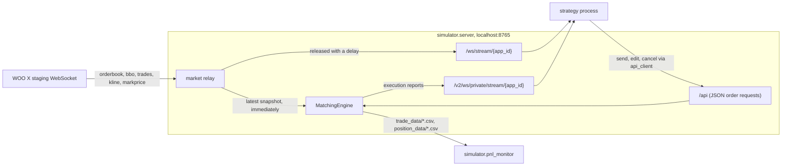

# Asynchronous Exchange Simulator

A paper-trading exchange written with `asyncio`. It relays the live WOO X staging market-data feed in the exchange's own message format, accepts orders over a WebSocket API, matches them against the live order book and trade stream, charges maker and taker fees, tracks hedge-mode positions and reports P&L in real time. A strategy switches from the exchange to the simulator by pointing its WebSocket URLs at `localhost` and swapping its REST client for `simulator/api_client.py`, which keeps the same method names; on the private stream it must subscribe with `{"method": "subscribe", "params": "executionreport"}`, because the exchange's `{event, topic}` message is not recognised.

Context: built between October 2024 and January 2025 in a five-person team during the Kronos Research Quantitative Trading Program (Automated Trading Team). This repository contains the components I built, the simulator and an order-book study; the team's trading systems, strategies and shared infrastructure are not included. See [Provenance](#provenance). Not affiliated with WOO X.

## Architecture



| Module | Role |
|---|---|
| `simulator/server.py` | WebSocket server with three endpoints (market stream, private stream, order API); relays the WOO X staging feed to clients with a release delay (see Known limitations) |
| `simulator/matching_engine.py` | Order handling and matching, fees, hedge-mode positions, execution reports, CSV trade and position logs |
| `simulator/api_client.py` | Async client whose method names mirror the WOO X REST client, so a strategy can switch between the exchange and the simulator |
| `simulator/pnl_monitor.py` | Live terminal dashboard (rich) and plots: realized and unrealized P&L, Sharpe and Calmar ratios, maximum drawdown and its duration |

## Matching rules

| Order type | Rule |
|---|---|
| `LIMIT`, `POST_ONLY` | Rest until a new 100-level order-book snapshot arrives, then walk the opposite side from the best price while the limit price allows, filling at book prices up to the displayed size. Unfilled quantity keeps resting; an order that does not cross on arrival is marked maker |
| `MARKET`, `ASK`, `BID` | Filled against prints from the `trades` topic whose aggressor side matches |
| `IOC`, `FOK` | One pass over the current snapshot; the remainder is dropped |
| Cancel | By order id or client order id, single, batch or all pending; the matching coroutine notices on its next iteration |
| Edit | Price or quantity, by client order id |

Fees: spot 0.10% taker / 0.08% maker, perpetual 0.05% taker / 0.02% maker. Positions are tracked per symbol for `LONG` and `SHORT` sides (hedge mode).

## Running

```bash
pip install -r requirements.txt
cp .env.example .env                 # set WOOX_APP_ID (WOO X staging application id), then export the variables
python -m simulator.server           # exchange on ws://localhost:8765
python -m simulator.pnl_monitor      # optional: live P&L dashboard
```

The simulator needs the live WOO X staging feed; it has no historical replay mode. The server clears `trade_data/` and `position_data/` on start.

## Tests

```bash
python -m unittest discover -s tests -t .
```

`tests/test_matching_engine.py` drives the engine with synthetic snapshots (no network): marketable buys and sells on the limit path, walking several levels, resting remainders, maker fills, an IOC sell, and fee rates.

## Changes made for publication

The code is the January 2025 version with these changes:

1. API credentials are read from environment variables instead of being written in the source.
2. Files renamed: `match_egine.py` → `matching_engine.py`, `backtest.py` → `pnl_monitor.py`. The modules form a package run with `python -m`, so `server.py` imports `.matching_engine`.
3. **Bug fix.** Sell orders read the bid list in reversed order. WOO X sends bids best-first, so on the limit path marketable sell orders were compared with the worst of the 100 bids and mostly never filled, and on the IOC/FOK path sells were filled from the worst qualifying bid upward. The reversal was removed at both sites; four of the five tests fail on the original code and pass now (the buy-side test passes either way).
4. Added: the tests, this README, `requirements.txt`, `.env.example`, `.gitignore`, the license.
5. Left out: the Redis bridge that republished the simulator's streams for the team's trading system (it was adapted from a teammate's data publisher), recorded outputs, and the data recorder of the order-book study (built on the program's WebSocket client template).

## Known limitations

- **No internal order book.** Client orders never trade with each other and there is no queue position. Displayed liquidity is not consumed, so the same size can be filled again on the next snapshot.
- **Optimistic resting fills.** A resting limit order is filled at the book price when the market reaches it, not at its own limit price, and pays the maker fee; once an order is marked maker it stays maker. `POST_ONLY` is handled exactly like `LIMIT`, so a crossing post-only order is filled as taker instead of being rejected.
- **Latency model.** The engine sees market data immediately and orders have no latency beyond the 0.1 s polling interval. On the client path, cached messages are released only when a later order-book update arrives whose timestamp exceeds theirs by a draw d ~ N(35 ms, 5 ms). The effective delay is therefore about one order-book push interval (roughly 0.5 s per symbol in data recorded from the feed), not 35 ms, and the re-queueing can reorder near-simultaneous messages.
- Market orders scan the trade list captured when matching starts, not later prints. `IOC`/`FOK` reports carry the limit price as executed price instead of the average fill price. The `FILLED` status test compares the last fill, not the cumulative fill, with the order quantity.
- The order API is a custom `{method, params}` JSON protocol over WebSocket (one request per connection, no authentication), not the exchange's signed REST API. Seven of its thirteen methods are stubs. The private stream recognises only `{method, params}` subscribe messages; a client that sends the exchange's `{event, topic}` message stays connected but receives no execution reports, and this path is not covered by the tests. `position` and `balance` pushes are empty. `reduce_only`, margin and balances are ignored.
- `pnl_monitor.py` annualizes with 252 × 390 minutes, an equity-market convention, although crypto trades around the clock.
- Written against the `websockets` handler signature `handler(websocket, path)`, which was removed in version 14. `server.py` imports `redis` but does not use it.

## Provenance

The matching engine, the P&L monitor, the API client, the server's endpoints, routing and relay logic, and the order-book study are my own work. The WOO X connection boilerplate in `server.py` (staging URL set-up, connect, HMAC signature helper, subscribe acknowledgement and ping/pong handling, about twenty lines) follows the data publisher that a teammate wrote earlier for the team's trading system. The original repository is private; nothing else from it is reproduced here.

## Order-book study

[`research/orderbook_direction/`](research/orderbook_direction/) holds an earlier assignment from the same program: recording WOO X order-book, BBO and trade data and classifying the next-second direction of the index price from order-book imbalance and order-flow features. Its README explains a look-ahead flaw in the headline factor.

## License

MIT for my own code, see [LICENSE](LICENSE) and [Provenance](#provenance). Market data is not included.
